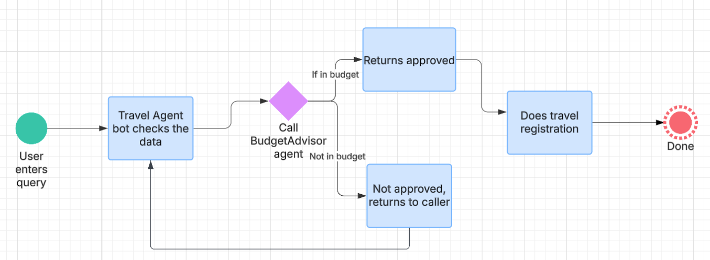

# Challenge 11 - Multiple Agents and execution strategies

[< Previous Challenge](./Challenge-09.md) - **[Home](../README.md)** - [Next Challenge >](./Challenge-11.md)

## Introduction

You have built different agents with different functionality to perform tasks required from your users.
Your managers gives you new assignment to integrate them to work together. In this challenge, you will build a
multi-agent system that uses multiple agents to solve a problem with minimal human interaction.

Since you are going to offsite, managers asks you to leverage intelligence to go to location which are in specific
your coworkers budgets (travel and expenses). You need to build a system which will now to call other agent to check if
the travel is in the boundaries of specific budget.

To safeguard the execution, agent decision criteria should not be larger than 5 exchanges between agents.

## Description

While a single agent can tackle specific tasks effectively, complex problems often demand collaboration. Multi-agent
systems introduce distributed intelligence, allowing agents to specialise and coordinate tasks in parallel. For example,
in a dynamic sales process, one agent could monitor social media trends, another analyses customer behavior and a third
provides actionable insights. This way, they work together for a holistic strategy.

Integrating multiple models into such systems amplifies their versatility. A single agent or even a group of agents tied
to one model can be limiting, particularly when diverse tasks demand specialised capabilities. By using multimodel
orchestration, agents to seamlessly use different models to get the most out of frontier models. For example, GPT-4
handles customer interactions, Llama 3.2 ensures real-time translations for global communication and .

Most common multi-agent systems are:

- **Collaborative pattern**: Agents that work together to achieve a common goal. This pattern is useful when you want to create an application where multiple agents can collaborate to make recommendations to users.
- **Hand-off pattern**: Agents that work together to achieve a common goal, but each agent has a specific role. This pattern is useful when you want to create an application where multiple agents can work together to achieve a common goal.This pattern is useful when you want to create an application where multiple agents can hand off tasks to each other.
- **Group pattern**: This pattern is useful when you want to create a group chat application where multiple agents can communicate with each other. Typical use cases for this pattern include team collaboration, customer support, and social networking.

Your task is to build a multi-agent system that uses multiple agents to solve a problem with minimal human interaction.

You have 2 instructions for the agent:
- **Travel Agent**: "You create detailed travel itineraries based on user preferences. You are very concise, to the point and do not waste time explaining things in detail. At the end of each plan, you also calculate your total and make sure you provide reasoning for that total budget. Consider suggestions when revising the travel plan.",
- **Budget Agent**: "You analyze travel plans and suggest adjustments to fit within the total cost. Your goal is to ensure that the user's travel plans are financially feasible and not beyond the total cost. If they are not within the range, provide feedback and reject the plan with 'no'. If it is within a range then approve it with 'yes'."

To expedite the request team provided you with the following:
- class [BudgetAdvisor](./Resources/Challenge-10/BudgetAdvisor.cs) -- Semantic Kernel Function which will help you to calculate the budget of the travel plan.
- class [AgentHelpers](./Resources/Challenge-10/AgentHelpers.cs) -- helper function to create an agent for Travel and Budget with Semantic Kernel.

Build a strategy to use the above agents to create a multi-agent system that can work together to achieve a common goal.

## Success Criteria

- Demonstrate that you have built a multi-agent system that uses multiple agents to solve a problem with minimal human
  interaction.
- Explain to your coach the flow and strategy used.

## Learning Resources

- [Semantic Kernel C#](https://github.com/microsoft/semantic-kernel/blob/main/dotnet/README.md)
- [Agent Chat](https://learn.microsoft.com/en-us/semantic-kernel/frameworks/agent/examples/example-agent-collaboration?pivots=programming-language-csharp)
- [Semantic Kernel Agent Chat Docs](https://learn.microsoft.com/en-us/dotnet/api/microsoft.semantickernel.agents.chat?view=semantic-kernel-dotnet)
